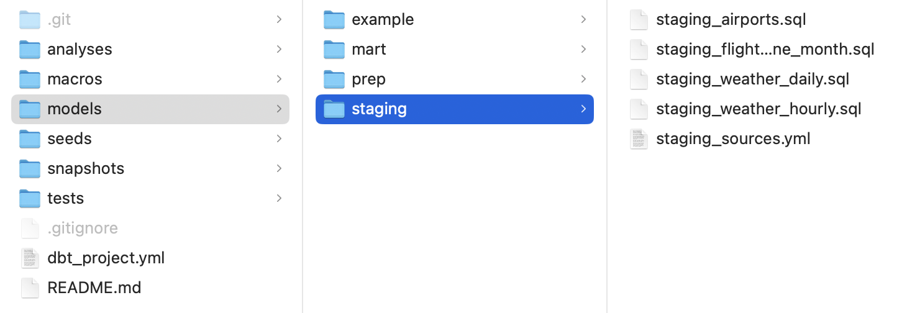

# dbt - stages


Photo by <a href="https://unsplash.com/@tegethoff?utm_source=unsplash&utm_medium=referral&utm_content=creditCopyText">Mark Tegethoff</a> on <a href="https://unsplash.com/photos/NbgQfUvKFE0?utm_source=unsplash&utm_medium=referral&utm_content=creditCopyText">Unsplash</a>

### Warmup: "KPIs for weather data"

In praxis to be able to fill a database with useful and organized tables, you would need to get familiar with the source data, in our case with the meteostat weather data. Think about what kind of information could be valuable for an end user. If that helps, imagine that you're asked for preparing a dashboard presenting some insights about this data. 

What kind of data structure would be easy to present this information. What would be an ideal table that you would like to see in your database - what fields should it have? 


## `dbt` / modeling layers

Good model layers improve the usability and understandability of your `dbt` project and your data warehouse, and can make it easier to build off of and grow over time.


To create the tables in all different layers we will use SQL (and CTE) that will be saved in the previously created repository. 


## More about particular layers:

### Base:
- the base layer is not always needed
- a good use case for using base models is when two sources must be joined to create a usable staging model (a situation where you would never use these components separately)

### Staging


The staging layer is the first main model directory in a `dbt` project. 
Staging contains base models, and staging models. 
Both of these layers are 1:1 with their source data (raw data) and do **very light transformations** like: 

- casting
- renaming
- filtering of bad data or deleted records
- no joining should happen in this layer, except for the joining of base models in a staging model when necessary.  
  

Many times staging will be the most used model type in a directory. Every source should end up as a staging model which is either 1:1 with a source OR a combination of base models.

> We will add staging models to the folder **staging**

*<small>[dbt documentation: **Staging**](https://docs.getdbt.com/best-practices/how-we-structure/2-staging)</small>*


### Intermediate:

Intermediate models are where we start to apply business logic and join staging models. Intermediate models are also a great place to create reusable logic that can be applied elsewhere in the [DAG](https://docs.getdbt.com/terms/dag).

The transformations here might include:
- joining tables
- feature engineering 
- extracting or expanding features

> We will add intermediate models to the folder **prep**

*<small>[dbt documentation: **Intermediate**](https://docs.getdbt.com/best-practices/how-we-structure/3-intermediate)</small>*


### Dimension/Fact (Marts):
Dimension and Fact models are core business models, such as dim_users which would contain all core dimensions/details about users for the business:
- dimension models are “things” (nouns) like users, stores, products, and so on
- fact models are “events” (verbs) like orders or transactions. Facts are something that happened

> We will add intermediate models to the folder **prep**

Best practice: put intermediate and dim/fact models into mart folders

*<small>[dbt documentation: **Marts**](https://docs.getdbt.com/best-practices/how-we-structure/4-marts)</small>*


### Seeds (optional)

Seeds are CSV files in your dbt project (typically in your `seeds` directory), that dbt can load into your [data warehouse](https://docs.getdbt.com/terms/data-warehouse) using the `dbt seed` command. 

Seeds are best suited to static data which changes infrequently.

Good use-cases for seeds:

- A list of mappings of country codes to country names
- A list of employee account IDs

Poor use-cases of dbt seeds:

- Loading raw data that has been exported to CSVs
- Any kind of production data containing sensitive information. 

> In case you'd use seeds, the CSV files would be added to the folder **seeds**

*<small>[dbt documentation: **Seeds**](https://docs.getdbt.com/docs/build/seeds)</small>*


## `yml` files
`yml` (or `yaml`) (Yet Another Markup Language) is a files extension that is often used for configuration files. We will use it in our `dbt` project to define the structure of your project and how your data will be modeled (e.g. if you're gonna create views or tables and in which locations).


## SQL and Jinja 

In `dbt` you can use SQL syntax to model your data. You could also combine SQL with Jinja which is a templating language. Jinja enables you to program with SQL in ways you wouldn't be able to do with SQL alone like:

- if statements
- for loops
- use of environment variables


## 1. dbt Project Configuration

To keep the workflow clear for our lectures straight-forward we apply changes to local repository only. After that we push it to GitHub and  then in the dbt Cloud IDE we pull from GitHub.

1. Before you begin modeling, modify the **`dbt_project.yml`** file in you local Git repo. Ensure that the last part of the file looks like the one below:

    ```yml
    models:
      my_new_project:
        # Applies to all files under models/staging/
        staging:
            materialized: table
        # Applies to all files under models/prep/
        prep:
            materialized: table
        # Applies to all files under models/mart/
        mart:
            materialized: table
    ```

    This way we make sure that all the data we're modeling (for staging, prep and mart) will be represented as tables (by default they will be views).

2. In your local git repository **`dbt_meteostat`** create 3 new directories under **`models`** directory:
    - staging
    - prep
    - mart

3. In your new **`staging`** directory create 5 new files:
    - **`staging_sources.yml`**
    - `staging_weather_daily.sql`
    - `staging_weather_hourly.sql`
    - `staging_airports.sql` 
    - `staging_flights_one_month.sql`

​		So it looks similar to this structure:

______



_____

​		Populate the **`staging_sources.yml`** file with the following code. Here we are adding sources based on which staging 		models will be created. 

4. Change **`#YOUR_SCHEMA#`** to your schema name:

    ```yml
    version: 2
    sources:
    
    - name: staging_weather
      schema: #YOUR_SCHEMA#
      tables:
        - name: weather_daily_raw
        - name: weather_hourly_raw
    
    - name: staging_flights
      schema: public
      tables:
        - name: flights
        - name: airports
        - name: regions
    ```

    That will make sure that your source data is properly located. Transformation will be done based on the table `weather_daily_raw` or  `weather_hourly_raw` in your schema. And also based on the tables `flights`, `airports` and `regions` in the schema **public**.

    *<small>[dbt documentation: **Sources**](https://docs.getdbt.com/docs/build/sources)</small>*

## 2. Setup your staging models

#### 2.1 Staging - Daily Weather

5. Populate the `staging_weather_daily.sql`  file with the following code:

    ```sql
    WITH daily_raw AS (
        SELECT
                airport_code,
                station_id,
                JSON_ARRAY_ELEMENTS(extracted_data -> 'data') AS json_data
        FROM {{source('staging_weather', 'weather_daily_raw')}}
    ),
    daily_flattened AS (
        SELECT  airport_code,
                station_id,
                (json_data->>'date')::DATE AS date,
                (json_data->>'tavg')::NUMERIC AS avg_temp_c,
                (json_data->>'tmin')::NUMERIC AS min_temp_c,
                (json_data->>'tmax')::NUMERIC AS max_temp_c,
                (json_data->>'prcp')::NUMERIC AS precipitation_mm,
                ((json_data->>'snow')::NUMERIC)::INTEGER AS max_snow_mm,
                ((json_data->>'wdir')::NUMERIC)::INTEGER AS avg_wind_direction,
                (json_data->>'wspd')::NUMERIC AS avg_wind_speed_kmh,
                (json_data->>'wpgt')::NUMERIC AS wind_peakgust_kmh,
                (json_data->>'pres')::NUMERIC AS avg_pressure_hpa,
                (json_data->>'tsun')::INTEGER AS sun_minutes
        FROM daily_raw
    )
    SELECT * 
    FROM daily_flattened
    ```

    *Study the code:*
    
    - a source can be referenced from a model using the [`{{ source("source_name", "table_name")}}`](https://docs.getdbt.com/reference/dbt-jinja-functions/source) Jinja code
    - check how the `JSON` file is being extracted to smaller chunks of information
    - feel free to modify the code to add more features if you find them useful. But maybe later.


6. **Stage** and **Commit the changes** in `staging_weather_daily.sql`, `staging_sources.yml` and `dbt_project.yml` with a comment in your local Git repo. **And push it to GitHub.**

7. Go to `dbt cloud`. Open **Cloud IDE** from "Develop" in the navigation bar. `dbt` will identify the changes in GitHub repo and the button will turn yellow with text "Pull from Remote". Click it.

   **Hint:** If the button is still green with the text "Create branch" click the dropdown arrow on the button's right and select "Refresh git state"

8. At the bottom, in the command line (it is not prominent, just that white field) and execute `dbt run`. A successful run will give you a positive feedback message. Otherwise fix the bugs.

9. If it was successful, connect to your database using your tool of preference (e.g. `dbeaver`, `psql`, etc.) and check if you can find newly created table/s there. Hint: right-click on the Schema and "Refresh".

   


#### 2.3 Staging - Hourly Weather

10. populate `staging_weather_hourly.sql` file with the following code:

    ```sql
    WITH hourly_raw AS (
        SELECT
                airport_code,
                station_id,
                JSON_ARRAY_ELEMENTS(extracted_data -> 'data') AS json_data
        FROM {{source('staging_weather', 'weather_hourly_raw')}}
    ),
    hourly_data AS (
        SELECT  
                airport_code
                ,station_id
                ,(json_data->>'time')::TIMESTAMP AS timestamp	
                ,(json_data->>'temp')::NUMERIC AS temp_c
                ,(json_data->>'dwpt')::NUMERIC AS dewpoint_c
                ,(json_data->>'rhum')::NUMERIC AS humidity_perc
                ,(json_data->>'prcp')::NUMERIC AS precipitation_mm
                ,(json_data->>'snow')::INTEGER AS snow_mm
                ,((json_data->>'wdir')::NUMERIC)::INTEGER AS wind_direction
                ,(json_data->>'wspd')::NUMERIC AS wind_speed_kmh
                ,(json_data->>'wpgt')::NUMERIC AS wind_peakgust_kmh
                ,(json_data->>'pres')::NUMERIC AS pressure_hpa 
                ,(json_data->>'tsun')::INTEGER AS sun_minutes
                ,(json_data->>'coco')::INTEGER AS condition_code
        FROM hourly_raw
    )
    SELECT * 
    FROM hourly_data
    ```

11. **Stage** and **Commit the changes** in `staging_weather_hourly.sql` with a comment in your local Git repo. **And push it to GitHub.**

12. Go to `dbt cloud`. Open **Cloud IDE** from "Develop" in the navigation bar. `dbt` will identify the changes in GitHub repo and the button will turn yellow with text "Pull from Remote". Click it.

    **Hint:** If the button is still green with the text "Create branch" click the dropdown arrow on the button's right and select "Refresh git state"

13. At the bottom, in the command line (it is not prominent, just that white field) and execute `dbt run`. A successful run will give you a positive feedback message. Otherwise fix the bugs.

14. If it was successful, connect to your database using your tool of preference (e.g. `dbeaver`, `psql`, etc.) and check if you can find newly created table/s there. Hint: right-click on the Schema and "Refresh".

    

#### 2.4 Staging - Airports and Flights data  

15. For the airports data, let's add the region information. This would require a  join of the two **base** tables `airports` and `regions`. Populate `staging_airports.sql` file with the code below.

    ```sql
    WITH airports_regions_join AS (
        SELECT * 
        FROM {{source('staging_flights', 'airports')}}
        LEFT JOIN {{source('staging_flights', 'regions')}}
        USING (country)
    )
    SELECT * FROM airports_regions_join
    ```
16. Because the flights data is over 8 million rows, for the development stage we will limit it to one month. Also **we will  materialize this model as a view** in order to minimize the disc space usage in our database. Although we defined in ` dbt_project.yml` that all tables in the folder staging materialized as tables, we can add the custom setting directly to our model `{{ config(materialized='view') }}`.

    Populate `staging_flights_one_month.sql` file with the code below.

    ```sql
    {{ config(materialized='view') }}
    
    WITH flights_one_month AS (
        SELECT * 
        FROM {{source('staging_flights', 'flights')}}
        WHERE DATE_PART('month', flight_date) = 1 
    )
    SELECT * FROM flights_one_month
    ```
    
11. **Stage** and **Commit the changes** in `staging_airports.sql`  and `staging_flights_one_month.sql` with a comment in your local Git repo. **And push it to GitHub.**

12. Go to `dbt cloud`. Open **Cloud IDE** from "Develop" in the navigation bar. `dbt` will identify the changes in GitHub repo and the button will turn yellow with text "Pull from Remote". Click it.

​		**Hint:** If the button is still green with the text "Create branch" click the dropdown arrow on the button's right and select 		"Refresh git state"

13. At the bottom, in the command line (it is not prominent, just that white field) and execute `dbt run`. A successful run will give you a positive feedback message. Otherwise fix the bugs.

14. If it was successful, connect to your database using your tool of preference (e.g. `dbeaver`, `psql`, etc.) and check if you can find newly created table/s there. Hint: right-click on the Schema and "Refresh".


## 3. Setup your prep models

#### 3.1 Prep - Daily Weather

1. In your `prep` directory create a file `prep_weather_daily.sql` that will add some information to your table created in the staging layer.

    
   
    - Our `prep_weather_daily` table wants to also include several informations derived from the "date" column.  
    
      **Hint:** use the [`DATE_PART`](https://www.postgresqltutorial.com/postgresql-date-functions/postgresql-date_part/) and [`TO_CHAR`](https://www.postgresqltutorial.com/postgresql-string-functions/postgresql-to_char/) functions.
    
    - We also want to add a column bucketizing the data in 4 seasons: winter, spring, summer, autumn. 
    
      **Hint:** use the [CASE WHEN](https://www.postgresqltutorial.com/postgresql-tutorial/postgresql-case/) statements.
    
    
    
    Use this skeleton and fill in the blanks `...` to make it work.  
    
    
    ```sql
    WITH daily_data AS (
        SELECT * 
        FROM {{ref('staging_weather_daily')}}
    ),
    add_features AS (
        SELECT *
    		, ... AS date_day
    		, ... AS date_month
    		, ... AS date_year
    		, ... AS cw
    		, ... AS month_name
    		, ... AS weekday
        FROM daily_data 
    ),
    add_more_features AS (
        SELECT *
    		, (CASE 
    			WHEN month_name in ... THEN 'winter'
    			WHEN ... THEN 'spring'
                WHEN ... THEN 'summer'
                WHEN ... THEN 'autumn'
    		END) AS season
        FROM add_features
    )
    SELECT *
    FROM add_more_features
    ORDER BY date
    ```

2. **Commit the changes** in `prep_weather_daily.sql`. **And push it to GitHub.**

3. Go to `dbt cloud`. Open **Cloud IDE** from "Develop" in the navigation bar. `dbt` will identify the changes in GitHub repo and the button will turn yellow with text "Pull from Remote". Click it.

   **Hint:** If the button is still green with the text "Create branch" click the dropdown arrow on the button's right and select "Refresh git state"

4. Execute `dbt run` and check the content of the database. Fix bugs if any.

     

#### 3.2 Prep - Daily Hourly

5. In your `prep` directory create a file `prep_weather_hourly.sql` that will add some information to your table created in the staging layer.

    Our `prep_weather_hourly` table wants to also include the information about weekday and the number of the day. Use this skeleton and fill in the two blanks `...` to make it work:

    **Hint:** The FM prefix suppresses the four spaces that would normally follow 'March'.
    
    ```sql
    WITH hourly_data AS (
        SELECT * 
        FROM {{ref('staging_weather_hourly')}}
    ),
    add_features AS (
        SELECT *
    		, timestamp::DATE AS date -- only time (hours:minutes:seconds) as TIME data type
    		, ... AS time -- only time (hours:minutes:seconds) as TIME data type
            , TO_CHAR(timestamp,'HH24:MI') as hour -- time (hours:minutes) as TEXT data type
            , TO_CHAR(timestamp, 'FMmonth') AS month_name -- month name as a text
            , ... AS weekday -- weekday name as text        
            , DATE_PART('day', timestamp) AS date_day
    		, ... AS date_month
    		, ... AS date_year
    		, ... AS cw
        FROM hourly_data
    ),
    add_more_features AS (
        SELECT *
    		,(CASE 
    			WHEN time BETWEEN ... AND ... THEN 'night'
    			WHEN ... THEN 'day'
    			WHEN ... THEN 'evening'
    		END) AS day_part
        FROM add_features
    )
    
    SELECT *
    FROM add_more_features
    ```
6. **Commit the changes** in `prep_weather_hourly.sql`. **And push it to GitHub.**

7. Go to `dbt cloud`. Open **Cloud IDE** from "Develop" in the navigation bar. `dbt` will identify the changes in GitHub repo and the button will turn yellow with text "Pull from Remote". Click it.

   **Hint:** If the button is still green with the text "Create branch" click the dropdown arrow on the button's right and select "Refresh git state"

8. Execute `dbt run` and check the content of the database. Fix bugs if any.


#### 3.3 Prep - Airport

9. In your `prep` directory create a file `prep_airports.sql` . We might only want to reorder the table the way that the column `region` comes after `country`. We would need to name all the columns from the staging table in the in the prep model's SELECT  statement 

    ```sql
    WITH airports_reorder AS (
        SELECT faa
        	   ,...
        	   ...
        FROM {{ref('staging_airports')}}
    )
    SELECT * FROM airports_reorder
    ```


#### 3.4 Prep - Flights

9. In your `prep` directory create a file `prep_flights.sql` .  

    As you remember during the SQL challenge we encountered the issue that some time related columns are casted as integers. Let's cast these columns as TIME

    - departure time
    - scheduled departure time
    - arrival time
    - scheduled arrival time

    Also while it is useful to have duration measures as absolute number of minutes, we could also add columns with as data type INTERVAL for:

    - departure delay
    - arrival ddelay
    - air time
    - actually elapsed time

    Finally the **distance** values are in miles and shall be converted to kilometers

    Use this skeleton and fill in the two blanks `...` to make it work:

    **Hint:** Check [TO_CHAR()](https://www.postgresql.org/docs/current/functions-formatting.html) function formatting examples in our 11c_date_functions.sql

    **Hint:** Casting syntax for [NUMERIC(precision, scale)](https://www.postgresql.org/docs/current/datatype-numeric.html) 

    ><sub>The *precision* of a `numeric` is the total count of significant digits in the whole number, that is, the number of digits to both sides of the decimal point. The *scale* of a `numeric` is the count of decimal digits in the fractional part, to the right of the decimal point. So the number 23.5141 has a precision of 6 and a scale of 4. Integers can be  considered to have a scale of zero.</sub>

    ```sql
    WITH flights_one_month AS (
        SELECT * 
        FROM {{ref('staging_flights_one_month')}}
    ),
    flights_cleaned AS(
        SELECT flight_date::DATE
                ,TO_CHAR(dep_time, 'fm0000')::TIME AS dep_time
                ,... AS sched_dep_time
                ,dep_delay
    		    ,(dep_delay * '1 minute'::INTERVAL) AS dep_delay_interval
                ,...::TIME AS arr_time
                ,...::TIME AS sched_arr_time
                ,arr_delay
                ,(...) AS arr_delay_interval
                ,airline
                ,tail_number
                ,flight_number
                ,origin
                ,dest
                ,air_time
                ,(...) AS air_time_interval
                ,actual_elapsed_time
                ,(...) AS actual_elapsed_time_interval
                ,(distance * 0.621371)::NUMERIC(6,2) AS distance_km -- see instruction hint
                ,cancelled
                ,diverted
        FROM flights_one_month
    )
    SELECT * FROM flights_cleaned
    ```

10. **Commit the changes** in `prep_airports.sql` and in `prep_flights.sql`. **And push it to GitHub.**

11. Go to `dbt cloud`. Open **Cloud IDE** from "Develop" in the navigation bar. `dbt` will identify the changes in GitHub repo and the button will turn yellow with text "Pull from Remote". Click it.

    **Hint:** If the button is still green with the text "Create branch" click the dropdown arrow on the button's right and select "Refresh git state"

12. Execute `dbt run` and check the content of the database. Fix bugs if any.


```Copyright "Agnieszka Kaczmarczyk, Samuel McGuire, Alex Schirokow```

This work is licensed under a [Creative Commons Attribution-ShareAlike 4.0 International License](https://creativecommons.org/licenses/by-sa/4.0/).