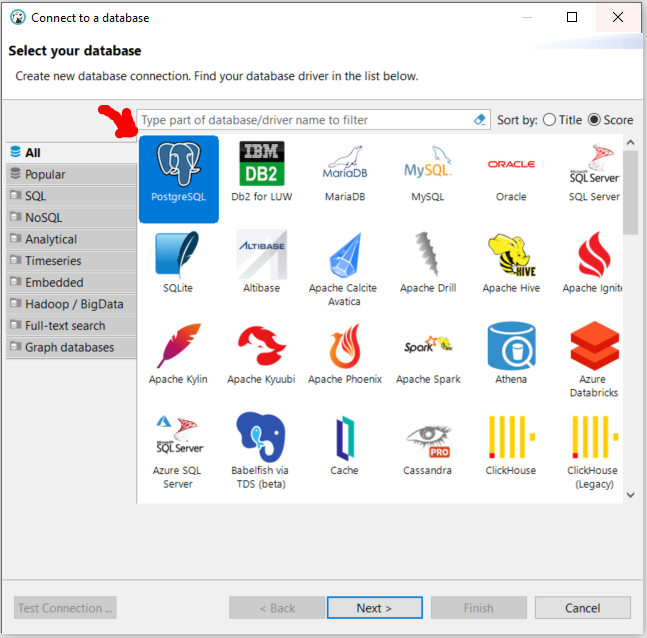
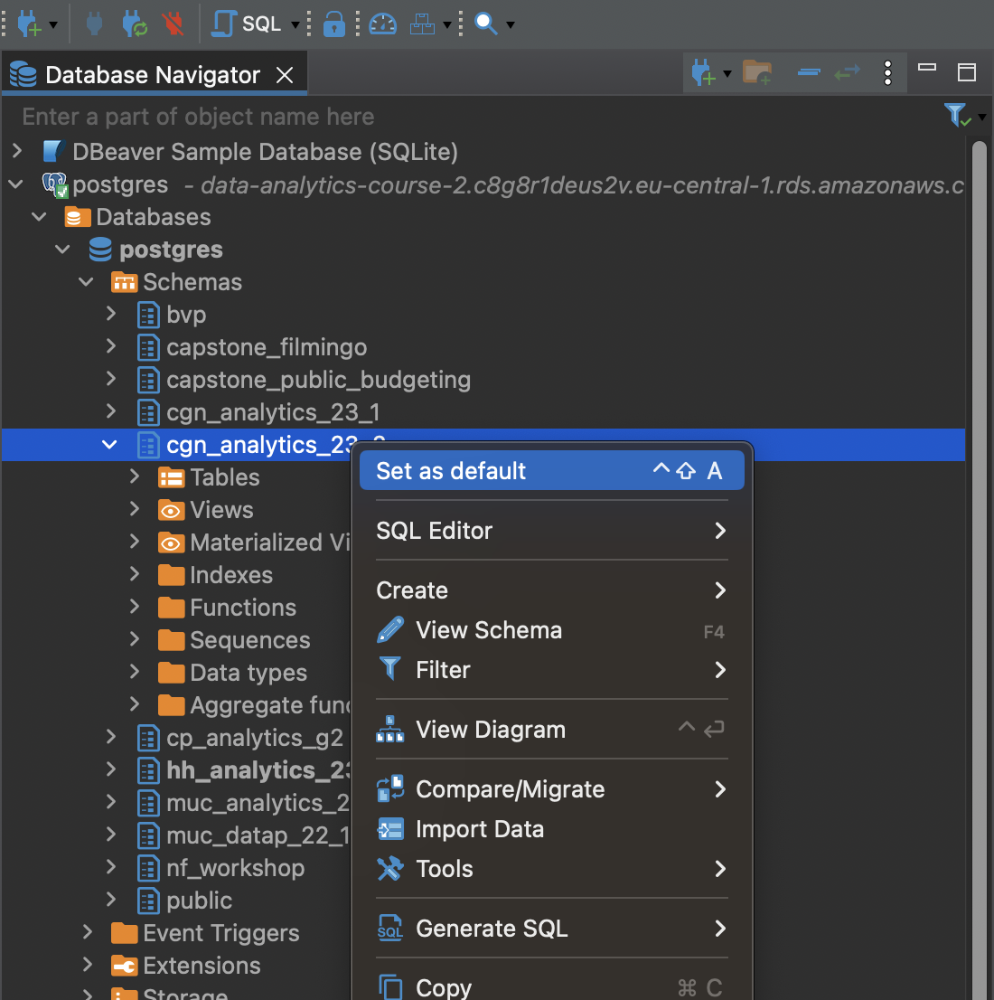
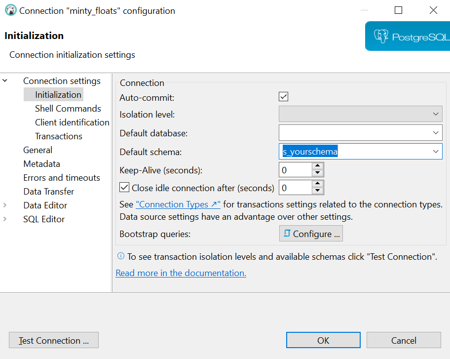
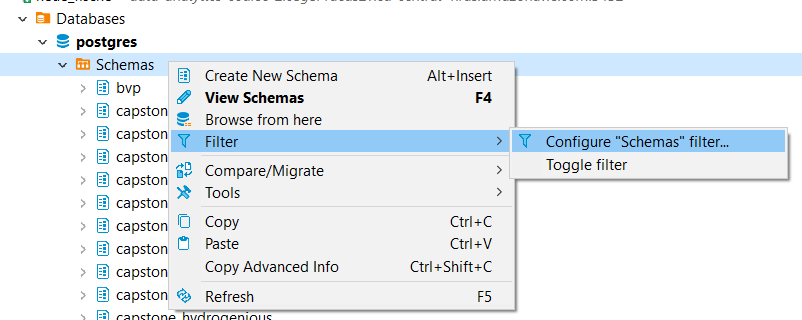
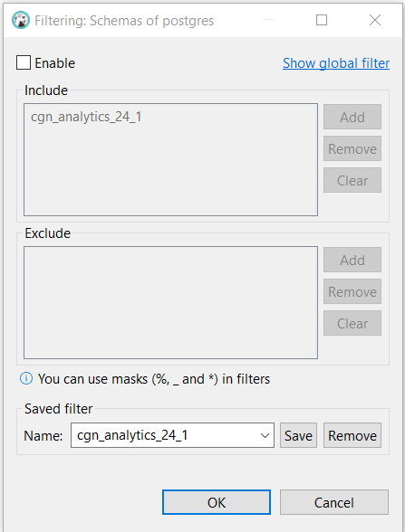
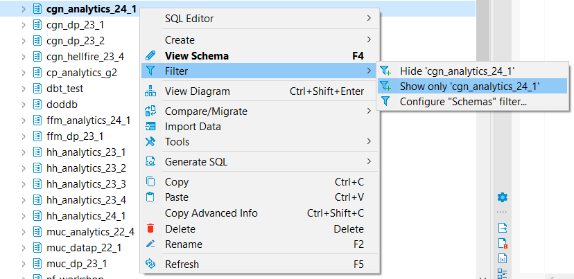

# Connecting to PostgreSQL Database

###  Objectives:
- DBeaver setup
- Connection to a Database in AWS 

## 1. Server-Client Model

PostgreSQL databases operate on a server-client model. The **server** hosts the databases, managing data storage, manipulation, and security. **Clients** are applications or tools that connect to the server to request data. They send queries to the server, which processes them and returns the results.

Some common PostgreSQL clients include:

- **psql**: A command-line tool that comes with PostgreSQL.
- **PgAdmin**: A popular graphical client for managing PostgreSQL databases.
- **DBeaver**: A universal database tool (supports PostgreSQL, but not only)
- **DataGrip**: A database IDE from JetBrains (supports PostgreSQL, but not only)
- **Tableau**: A business intelligence tool that can connect to PostgreSQL for data analysis.

	>**SQL Client / Database IDE**
	>
	>- IDE = **I**ntegrated **D**evelopment **E**nvironment
	>- Powerful software that can be used to connect to a database and retrieve and visualise data (and more!)
	>- Local or in the cloud
	>- Open-source, free and paid software is available

## 2. DBeaver Setup

In this course we will use DBeaver

**DBeaver** is a powerful desktop sql editor, integrated development environment (IDE) and it has a graphical user interface  (GUI) for databases (not only postgres).

>### ➥ Download and install [DBeaver](https://dbeaver.io/download/)

## 3. Connecting to a **PostgreSQL** database in AWS

1. Click on “New Database Connection” 
2. Download Driver (if necessary)
3. Search for and select PostgreSQL
4. Enter the connection details below

| Syntax      | Description |
| ----------- | ----------- |
| **Host**      | data-analytics-course-2.c8g8r1deus2v.eu-central-1.rds.amazonaws.com       |
| **Port**   | 5432        |
| **Database**   | postgres        |
| **Username**   | Will be sent to you via e-mail / posted in Slack/Zoom Chat        |
| **Password**   | Will be sent to you via e-mail / posted in Slack/Zoom Chat        |

## 4. **Default Schema and Schema Filter** 

#### 4.1 Set the schema for this class as default (manually)

- Expand it to:
  	**postgres** > **Databases** > **postgres** > **Schemas**

  1. click the schema > ctrl + shift + A

     or

  2. right click the schema and choose set as default

#### 2.2 Set Schema to be default from start (default setting)

- Right-Click on your SQL Connection > Edit Connection > Select `Initialization` under `Connection Settings`
- enter the name of the database and schema which you need to be selected as default on start.

#### 4.3 Filter Schemas to only one Schema

- Right-Click on your Schema folder > Filter > Configure "Schemas" filter.

- Add the name of the schema to `Include` and add name for the filter under `Saved filter`
- Click OK

#### 4.4 Filter Schemas to only one Schema (the quick way)

- Right-Click on your Schema name you want to keep > Filter > Show only <schema name>

## 5. Editor Settings (optional)

#### Open DBeaver > Window > Preferences  

- Enable upper case: 

  ​	**Editors > SQL Editor > Formatting > Keyword Case >** Set to: 'Upper'

- Disable/Enable Auto-Convert to preset keyword case:  
  **Editors > SQL Editor > Code Editor > Convert keyword case >** Tick box

- Disable Auto-Completion:  
  **Editors > SQL Editor > Code Completion > Enable auto activation >** Tick box

- When keeping Auto-Completion, define the Case to use:  
    **Editors > SQL Editor > Code Completion > Insert Case >** Select 'Upper case' from the drop box

- Add line numbers: 

  ​	**Editors > Text Editors > Show line numbers >** Tick box

